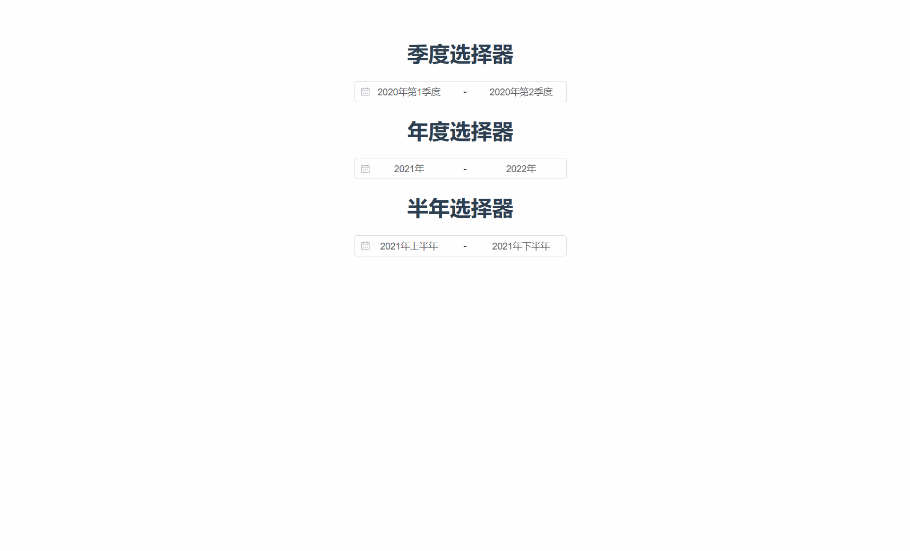

# select_range

项目采用版本 "element-plus": "^2.9.1", 如果样式不生效，请更换相应类名


 


## Project setup

```
npm run pinstall
```

### Compiles and hot-reloads for development

```
npm run dev
```

### Compiles and minifies for production

```
npm run build
```

### Lints and fixes files

```

```
